# Proposta de Pesquisa — Avaliação Empírica de Variantes de Multicast Atômico para Partitioned State Machine Replication

**Alunos:** Agatha Schneider, Fernando Vieira, Gustavo Flores, João Lucas Martinello de Oliveira, Rodrigo Fehlauer Lauermann.
**Orientador:** Prof. Fernando Dotti.

## Abstract

Este trabalho propõe reproduzir e avaliar empiricamente as variantes do algoritmo de multicast atômico de Skeen a partir do artigo *Strengthening Atomic Multicast for Partitioned State Machine Replication* (Pacheco, Dotti e Pedone, LADC 2022). O artigo prova, de forma puramente teórica, que o multicast atômico com a propriedade clássica de *global total order* não é suficiente para garantir linearizabilidade em *partitioned state machine replication* e propõe a propriedade mais forte de *atomic global order*, materializada em uma extensão do protocolo de Skeen com um passo extra de confirmação (*ack*). Como o artigo não traz avaliação experimental, nosso objetivo é realizar um benchmark comparativo entre (i) o Skeen clássico, (ii) o Skeen estendido com *atomic global order* e (iii) uma variante bizantina (Byzcast), utilizando um protótipo Java disponível publicamente como repositório de código-fonte, medindo latência, throughput e custo de coordenação sob diferentes cargas e taxas de requisições multi-partição.

## 1. Introdução

A combinação de *state machine replication* (SMR) com particionamento de estado (*sharding*) permite simultaneamente tolerância a falhas e escalabilidade de desempenho. Nessa abordagem, conhecida como *partitioned state machine replication*, cada partição é implementada por um grupo de réplicas e as requisições são propagadas às partições relevantes por meio de *multicast atômico*, uma abstração de comunicação que ordena mensagens consistentemente dentro e entre grupos.

O artigo de Pacheco, Dotti e Pedone (LADC 2022) argumenta que o multicast atômico, quando aplicado à replicação de máquina de estados particionada, não é suficiente para garantir linearizabilidade sem a necessidade de coordenação adicional entre as réplicas. Para contornar essa limitação, os autores propõem o fortalecimento do multicast atômico, permitindo que as réplicas executem requisições imediatamente após sua entrega, sem coordenação extra. Para isso, substituem a propriedade de ordem total global por uma relação de ordenação mais forte, denominada *atomic global order*, que preserva dependências de tempo real entre as mensagens.

Nosso trabalho parte da observação de que o artigo original é puramente teórico — apresenta provas de corretude e uma extensão ao Algoritmo 1 de Skeen, mas não reporta medições. Propomos, portanto, validar empiricamente o custo e os ganhos da extensão através de um benchmark controlado entre as principais variantes de multicast atômico, apoiando-nos em um protótipo Java já existente cujo código-fonte está disponível em um repositório público.

## 2. Referencial Teórico — Apresentação do Artigo

- **Título:** Strengthening Atomic Multicast for Partitioned State Machine Replication.
- **Autores:** Leandro Pacheco (Università della Svizzera italiana — USI, Suíça), Fernando Dotti (Escola Politécnica, PUCRS — Brasil), Fernando Pedone (Università della Svizzera italiana — USI, Suíça).
- **Evento:** 11th Latin-American Symposium on Dependable Computing (LADC 2022), 21–24 de novembro de 2022, Fortaleza, CE, Brasil.
- **Publicação:** *Proceedings of the 11th Latin-American Symposium on Dependable Computing*, ACM, New York, NY, USA, 10 páginas.
- **DOI:** 10.1145/3569902.3569909.
- **Link de acesso:** <https://dl.acm.org/doi/10.1145/3569902.3569909>.
- **Número de citações:** 6 (Google Scholar, consultado na data de elaboração desta proposta — será revalidado próximo à entrega final).
- **Financiamento reconhecido pelos autores:** CNPq (Brasil), FAPERGS (RS, Brasil) e PUCRS-PrInt/CAPES (Brasil).

## 3. Resumo do Artigo

### 3.1 Descrição do problema

Em *partitioned state machine replication*, o estado da aplicação é dividido em partições e cada partição é replicada com SMR clássica. Requisições que acessam uma única partição podem ser ordenadas localmente, mas requisições que tocam múltiplas partições precisam ser ordenadas consistentemente entre todas as réplicas envolvidas. O multicast atômico é usado como abstração para propagar essas requisições.

A taxonomia de Hadzilacos e Toueg define a forma mais forte de multicast atômico como aquela que satisfaz *validity*, *agreement*, *integrity*, *global total order* e *prefix order*. O artigo demonstra, através do exemplo de uma loja chave-valor com duas partições (Figura 2 à esquerda do artigo), que mesmo satisfazendo todas essas propriedades é possível observar execuções não linearizáveis: uma *range query* concorrente com dois *inserts* em partições distintas pode "enxergar" os efeitos em ordem incompatível com o tempo real. Para corrigir isso, sistemas como S-SMR (Bezerra et al., 2014) introduzem uma fase ad-hoc de mensagens de sinalização entre partições durante a execução de requisições multi-partição.

### 3.2 Contribuições

1. **Prova formal (Seção 3.1 do artigo):** mostra-se que *global total order* não captura dependências de tempo real entre multicast e deliver, obrigando coordenação extra entre réplicas para assegurar linearizabilidade em *partitioned SMR*.
2. **Nova propriedade *atomic global order* (Seção 3.2):** uma relação ≺ mais forte onde m ≺ m' se (i) algum processo entrega m antes de m', ou (ii) m' é enviado em multicast após m ter sido entregue em algum destino, em tempo real, exigindo que ≺ seja acíclica.
3. **Extensão do algoritmo de Skeen (Seção 4.2, Algoritmo 1):** acrescenta-se um passo de confirmação — ao decidir o *final timestamp* de uma mensagem m, o processo envia um *ack* aos demais destinos e só entrega m após coletar todos os *acks*. Com isso, nenhum outro destino pode atribuir *timestamp* menor ou igual ao de m depois da entrega. A prova informal acompanha o algoritmo.
4. **Análise comparativa (Seção 5):** argumenta-se que a extensão se aplica a vários descendentes do Skeen (FastCast, Scalatom, White-Box Atomic Multicast, RamCast, Byzcast); entre os protocolos revisados, apenas o *round-based* de Schiper & Pedone (2008) já satisfaz *atomic global order*.

### 3.3 Resultados obtidos/esperados

Os resultados do artigo são **teóricos**: provas de corretude e especificação do protocolo estendido. O artigo não apresenta avaliação experimental — a Seção 5 é de *related work* e a Seção 6 apenas conclui, deixando em aberto se existe uma propriedade intermediária entre *global total order* e *atomic global order* que ainda evite coordenação adicional, mas aceite mais execuções linearizáveis. É exatamente essa lacuna empírica que o presente trabalho busca preencher.

## 4. Objetivo e Metodologia

### 4.1 Objetivo

Realizar um **benchmark comparativo** entre variantes de multicast atômico, utilizando o protótipo Java disponível publicamente em <https://github.com/elbatista/skeen/tree/master>, para quantificar o custo da propriedade *atomic global order* proposta no artigo e compará-lo com um *baseline* clássico e uma variante bizantina. As variantes previstas, selecionáveis por linha de comando no protótipo, são:

- **(A) Skeen clássico** — *baseline*; implementa o Algoritmo 1 do artigo *sem* as adições em cinza.
- **(B) Skeen estendido com *atomic global order* (rotulado "flex" no protótipo)** — adiciona o passo de *ack* entre destinos descrito na Seção 4.2 do artigo.
- **(C) Variante bizantina (rotulada "byz" no protótipo)** — protocolo no estilo Byzcast (Coelho et al., 2018), referência [7] do artigo-base.

> **Observação de escopo:** uma inspeção preliminar do repositório indica que, no estado atual, o servidor do protótipo instancia apenas o Skeen clássico, independentemente do rótulo de algoritmo escolhido. Um dos primeiros passos do trabalho será confirmar esse ponto e, se necessário, implementar a extensão de *atomic global order* (e eventualmente integrar Byzcast) para viabilizar a comparação central pretendida pelo artigo.

### 4.2 Questões de pesquisa

1. Qual é o custo (em latência e *throughput*) do *ack* extra de *atomic global order* em relação ao Skeen clássico?
2. Como esse custo varia com a taxa de mensagens multi-partição (parâmetro de localidade da carga)?
3. Como o custo escala com o número de partições/servidores e de clientes?
4. Como a variante bizantina (Byzcast) se posiciona em termos de custo/benefício frente às variantes tolerantes a falhas por parada?

### 4.3 Metodologia

1. **Mapeamento artigo ↔ código:** cruzar as linhas em cinza do Algoritmo 1 do artigo com as funções correspondentes do protótipo e identificar (ou implementar) as variantes "flex" e "byz".
2. **Build e validação:** compilar o protótipo com a cadeia de *build* fornecida pelo repositório e executar uma rodada mínima local para validar a instrumentação.
3. **Matriz experimental** combinando os parâmetros aceitos pelos *scripts* de execução do protótipo:
   - `duration` — 60 s por execução (após aquecimento).
   - `algo` ∈ {*skeen*, *flex*, *byz*}.
   - `#clientes` ∈ {1, 4, 16, 64}.
   - `#servidores` ∈ {2, 3, 4}.
   - `%localidade` ∈ {0, 25, 50, 75, 100} — 0% significa todas as mensagens multi-partição.
   - `#mensagens` fixo por cliente.
   - `#repetições` ≥ 3 para média e desvio-padrão.
4. **Cargas (*workloads*):**
   - **TPC-C**, já embutida no cliente do protótipo — carga realista de transações OLTP.
   - **Key-value com *range queries***, reproduzindo o cenário da Figura 2 do artigo: *inserts* (single-partition) e *range queries* (multi-partition); evidenciará concretamente o ponto de violação de linearizabilidade do Skeen clássico.
5. **Ambientes de execução:**
   - Local, para *shakedown* e testes rápidos.
   - Geo-distribuído, para medir sob latências WAN realistas, preferencialmente utilizando o Cloudlab. Plano B: se não houver acesso ao Cloudlab, emular latência entre processos com `tc netem` em máquina única ou entre VMs locais.
6. **Coleta e análise:** agregar logs com os *scripts* de coleta do repositório e processar com o *script* de análise em Python também fornecido; métricas-alvo:
   - *Throughput* (msgs/s).
   - Latência (média, p50, p95, p99).
   - Custo de mensagens por operação, via instrumentação de estatísticas já presente no protótipo.
7. **Apresentação dos resultados:** gráficos comparativos (latência × %localidade, *throughput* × #clientes, escalabilidade × #servidores) e discussão frente ao *overhead* esperado. A referência analítica é que o Skeen clássico completa em ~3 passos de comunicação (*start*, *local-ts*, *delivery*) e a extensão adiciona 1 passo (*ack*), sugerindo aumento de latência em torno de 33% — a ser validado empiricamente.

### 4.4 Fluxo experimental

```mermaid
flowchart LR
    artigo["Artigo - Algoritmo 1"] --> map["Mapear extensao no protótipo"]
    map --> build["Compilar protótipo"]
    build --> run["Executar: algo skeen/flex/byz"]
    run --> logs["Logs de execucao"]
    logs --> agg["Agregacao de resultados"]
    agg --> analise["Analise em Python"]
    analise --> plots["Graficos: latencia, throughput, escalabilidade"]
    plots --> discussao["Discussao vs. artigo"]
```

## 5. Levantamento de Requisitos para Reprodução

Os requisitos abaixo estão listados com status de disponibilidade e, quando aplicável, URL.

| Requisito | Status | Observações |
| --- | --- | --- |
| Artigo-base | Disponível | Versão publicada em <https://dl.acm.org/doi/10.1145/3569902.3569909>. |
| Código-fonte do protótipo | Disponível | Repositório público em <https://github.com/elbatista/skeen/tree/master> (Skeen: protótipo de multicast atômico em Java). |
| Apache Ant + JDK 8+ | Disponível | Cadeia de *build* padrão utilizada pelo repositório. |
| Bibliotecas Java (Netty, Apache Commons CLI, etc.) | Disponível | Distribuídas junto com o repositório; versões a serem documentadas no relatório do trabalho. |
| *Workload* TPC-C | Disponível | Já embutida no cliente do protótipo; não requer dataset externo. |
| *Workload* key-value com *range queries* | A recriar | Cliente mínimo análogo ao exemplo da Figura 2 do artigo; a ser implementado pelo grupo caso não exista no repositório. |
| Variantes "flex" e "byz" do servidor | A verificar / implementar | Conforme inspeção preliminar, o servidor do protótipo pode estar instanciando apenas o Skeen clássico; pode ser necessário implementar a extensão de *atomic global order* e/ou integrar Byzcast. |
| Arquivos de configuração de *hosts*, servidores, clientes e localidade | Disponíveis | Distribuídos no repositório; precisam ser ajustados para a topologia de cada experimento. |
| *Scripts* de execução e coleta (local e Cloudlab) | Disponíveis | Fornecidos pelo repositório. |
| Ambiente Python para análise | A verificar | Dependências a serem listadas em `requirements.txt` (provavelmente numpy, matplotlib, pandas). |
| Equipamento local | Disponível | Máquina do grupo com CPU multi-core para rodar 2–4 servidores + clientes. |
| Equipamento geo-distribuído | A solicitar/emular | Cloudlab (solicitar acesso via orientador) ou VMs com latência WAN emulada via `tc netem`. |
| Documentação de reprodução (passo a passo) | A criar | README do trabalho com comandos, parâmetros e formato dos resultados. |
| Benchmark TPC-C (especificação oficial) | Disponível | <http://www.tpc.org/tpcc/>. |

## 6. Impacto e Conexão com a Sociedade

Serviços críticos que sustentam a vida cotidiana moderna — sistemas bancários, plataformas de pagamento como o Pix, prontuários eletrônicos, identidade digital (gov.br), *blockchains* permissionadas e bancos de dados em nuvem — dependem de replicação particionada para escalar com tolerância a falhas. O exemplo inicialmente usado pelo orientador em sala, sobre saldos bancários, ilustra bem o risco: sem ordenação consistente de requisições multi-partição, é possível o sistema apresentar estados impossíveis, como "criar" dinheiro ao consolidar *timelines* de partições distintas. O artigo mostra que, com o multicast atômico clássico, cada requisição multi-partição carrega uma coordenação silenciosa adicional que se traduz em mais *round-trips* de rede, mais latência para o usuário final e maior consumo de recursos de *data center*.

Medir empiricamente esse custo tem valor prático e social: permite que projetistas de sistemas críticos decidam de forma informada quando vale a pena adotar a extensão de *atomic global order* em detrimento da coordenação ad-hoc, potencialmente reduzindo latência em operações sensíveis (transferências, autorizações em saúde, liquidação de títulos) e o consumo energético associado. Adicionalmente, o trabalho é um exercício formativo em pesquisa reprodutível em sistemas distribuídos, dialogando diretamente com a pesquisa de ponta desenvolvida no Brasil — o artigo-base tem coautoria do próprio orientador da disciplina e apoio de CNPq, FAPERGS e CAPES — e fortalecendo a capacidade do grupo de ler, criticar e estender literatura de alto impacto na área.

## 7. Referências

- Pacheco, L.; Dotti, F.; Pedone, F. (2022). *Strengthening Atomic Multicast for Partitioned State Machine Replication.* In: 11th Latin-American Symposium on Dependable Computing (LADC 2022), Fortaleza, Brasil. ACM. DOI: 10.1145/3569902.3569909. Disponível em: <https://dl.acm.org/doi/10.1145/3569902.3569909>.
- Birman, K. P.; Joseph, T. A. (1987). *Reliable Communication in the Presence of Failures.* ACM Transactions on Computer Systems, 5(1), 47–76. (Protocolo de Skeen, referência [5] do artigo-base.)
- Bezerra, C. E.; Pedone, F.; Van Renesse, R. (2014). *Scalable State-Machine Replication.* In: DSN 2014, 331–342. (S-SMR, referência [4].)
- Coelho, P.; Ceolin Jr., T.; Bessani, A.; Dotti, F.; Pedone, F. (2018). *Byzantine Fault-Tolerant Atomic Multicast.* In: DSN 2018, 39–50. (Byzcast, referência [7].)
- Hadzilacos, V.; Toueg, S. (1994). *A Modular Approach to Fault-Tolerant Broadcasts and Related Problems.* Technical Report, Cornell University. (Taxonomia de multicast atômico, referência [20].)
- Herlihy, M. P.; Wing, J. M. (1990). *Linearizability: A Correctness Condition for Concurrent Objects.* ACM TOPLAS, 12(3), 463–492. (Referência [21].)
- Lamport, L. (1978). *Time, Clocks, and the Ordering of Events in a Distributed System.* Communications of the ACM, 21(7), 558–565. (Referência [22].)
- Schiper, N.; Pedone, F. (2008). *On the Inherent Cost of Atomic Broadcast and Multicast in Wide Area Networks.* In: ICDCN 2008, 147–157. (Referência [32].)
- Transaction Processing Performance Council. *TPC Benchmark C (TPC-C).* Disponível em: <http://www.tpc.org/tpcc/>.
- Batista, E. R. L. *Skeen — Prototype of a multicast Skeen implementation.* Repositório público de código-fonte. Disponível em: <https://github.com/elbatista/skeen/tree/master>.
